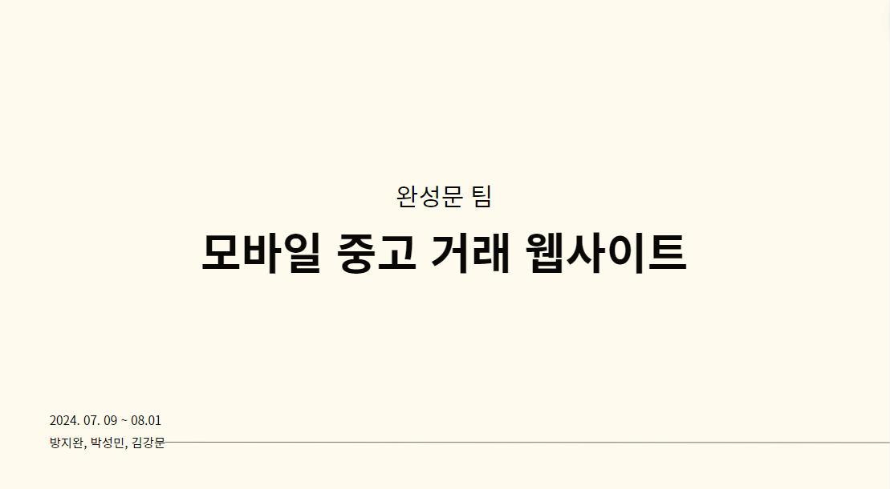

<h1>TEAM wansungmoon README</h1>

- github 주소: https://github.com/JiwanBang/team_wansungmun
- TEST ID: test1@naver.com
- TEST PW: 1234qwer

## 프로젝트 소개

- 모바일 웹 UI 쇼핑몰 사이트
- 유저는 상품 등록 및 판매 가능
- 주문한 상품에 대한 실시간 배송 추적

## 미션 가이드

- 목표: 쇼핑몰 사이트 구축

### UX

- 물건 판매 및 구매

- 지도 확인 기능

- 배달 현황 공유 프로그램(네이버 지도, 카카오 맵 등 내비게이션 프로그램과 카카오T, 배달의 민족과 같은 실시간 배달 현황 공유 프로그램)

- 결제에 대한 중간 관리(포인트 사용)

### UI

- 사용자: 회원가입, 로그인, 로그아웃, 정보 수정

- 관리자: 사용자와 게시판에 대해 수정/사용자의 문의에 대한 답변/게시판 카테고리에 대한 설정/서비스 사이트와 분리 필요

- 포인트: 결제 시스템 대신으로 사용. 현금과 같은 기능

- 게시판: 글 작성, 사진/영상 등 업로드 가능, 회원에 대해 권한 부여, 포인트로 구매 설정 가능

- 지도: 지도 API를 사용, 배달 인원의 위치 정보를 공유

## 1. 팀원 구성

- 팀장: 방지완
- 팀원: 김강문, 박성민

## 2. 역할 분배

### 공통

- 피그마 UI 초안 작성 및 공통적으로 사용하는 컴포넌트 제작

### 박성민: 프론트엔드

- 피그마 UI 레퍼런스 참조
- 상단 헤더, 하단 메뉴바 컴포넌트 제작
- 공통 컴포넌트 전반 제작
- 메인페이지 프론트엔드
- 내정보페이지 프론트엔드
- 충전페이지 프론트엔드
- 상품페이지 프론트엔드
- 구매페이지 프론트엔드, 배송지 선택 모달창
- 배달 기사 페이지 프론트엔드, 배달 상품 상세 확인 프론트엔드
- 관리자페이지 프론트엔드

### 김강문: 프론트엔드/백엔드

- 주문 내역, 주문 상세 페이지 백엔드
- 공통 컴포넌트 전반 제작
- 지도 API 구현 및 실시간 배송 추적 기능
- 시퀄라이즈 모델 제작
- 유저 거래 내역에서 배송 추적 정보 받아오기
- 상품 페이지 백엔드
- 메인페이지 백엔드
- 배송 기사 페이지 백엔드
- 몽고DB 환경 구축

### 방지완: 일정 관리 및 문서 작성, 프론트엔드 및 백엔드

- API 문서, ERD, sequence-diagram, flow chart 작성
- 구글 문서를 이용한 회의록 작성, 피드백 기록, 스프레드시트를 통한 진행사항 체크리스트, 이슈 체크리스트 작성
- 이메일 로그인 및 회원가입 프론트엔드, 백엔드
- 카카오 로그인 API를 이용한 oauth 로그인, 회원가입 프론트엔드, 백엔드
- 로그인 및 로그인 체크 백엔드
- 상품 등록 페이지 백엔드
- 상품 구매 페이지 백엔드

## 3. 작업 환경

### Front

- React, typescript 환경에서 개발

- axios, cors, react-kakao-map, react-router-dom, tailwindcss, recoil 라이브러리 사용

- 카카오 로그인 API, 카카오 지도 API

### Backend

- typescript, nodeJS

- mysql2, mongoose, multer, express-session, session-file-store 라이브러리 사용

### DATABASE

- 회원 정보, 게시글 등 정보 전반을 저장하기 위해 mysql 사용
- 실시간 위치 추적 로그를 위해 mongoDB 사용

### 협업 툴

- discord, 카카오톡, github

- <a href="https://docs.google.com/spreadsheets/d/1YYTHFA4z5n_9RmOORPQNLY4iAA3rs3uAcLll98YYpOQ/edit?gid=1151140447#gid=1151140447">구글 스프레드시트</a>: 진행사항 체크리스트, 이슈 체크리스트, api 문서 작성

- <a href="https://drive.google.com/drive/folders/16peHCoF_gTmYik9AmuTj2WVmXGPeQQDG">구글 공유 드라이브</a>: 스크럼 및 회의록, 피드백 사항 문서 저장

- <a href="https://www.figma.com/design/lhPuCmiYz7lx87LLq2kwbA/team_wansungmun?node-id=0-1">디자인: </a> 피그마를 통해 UI 초안 작성

- <a href="https://app.diagrams.net/#G18p2nr8EsjUGMysP9U5TyHFSIbiR54iRz#%7B%22pageId%22%3A%22R2lEEEUBdFMjLlhIrx00%22%7D">drawio ERD</a>

- <a href="https://app.diagrams.net/#G1keKKyQTy96aBUscvoXCxPwICgn1bU4Yb">drawio sequence diagram</a>

- <a href="https://app.diagrams.net/#G1NAZse4vY_8-I-1zBIkdxO8yBdIjG28Py">drawio flowchart</a>

## 4. 개발 기간 및 작업 관리

### 개발 기간

- 전체 개발 기간: 2024.07.09 ~ 2024.07.31
- RND 및 설계 단계: 07.09 ~ 07.14
- 기능 구현: 07.15 ~ 07.31

### 작업 관리

- 설계 기간동안 외부 API나 기존에 쓰지 못했던 기술에 대해 중점적으로 연습 및 연구

- 작업동안 일간 스크럼을 통해 전일 작업 내용 공유, 금일 작업 내용 결정

- 스크럼 및 회의록 기록, 일정 체크리스트를 통해 전체적인 일정 진척도를 파악하고 작업의 우선순위를 결정해서 필수적인 기능 위주로 구현할 수 있도록 함

## 5. 미구현 기능

- 관리자 페이지 백엔드
- 채팅 기능
- 검색 기능
- 각 유저별 주소록 저장 및 열람
- 리뷰 작성 페이지
- 신고 페이지
- 찜 목록 기능
- 포인트 충전 기능
- 회원 정보 수정
- 게시글 수정 기능
